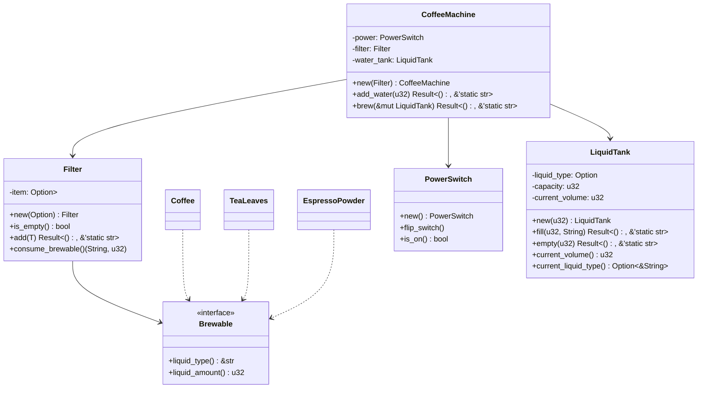

# Coffee Machine

```mermaid
classDiagram
    class CoffeeMachine{
        +new(Filter) CoffeeMachine
        +add_water(u32) Result<(), &'static str>
        +brew(&mut LiquidTank) Result<(), &'static str>
        -power: PowerSwitch
        -filter: Filter
        -water_tank: LiquidTank
    }

    class Brewable{
        <<interface>>
        +liquid_type() &str
        +liquid_amount() u32
    }

    class Coffee{

    }
    class TeaLeaves{

    }
    class EspressoPowder{

    }

    class Filter{
        +new(Option<T>) Filter
        +is_empty() bool
        +add(T) Result<(), &'static str>
        +consume_brewable() (String, u32)
        -item: Option<Box<dyn Brewable>>
    }

    class PowerSwitch{
        +new() PowerSwitch
        +flip_switch()
        +is_on() bool
    }

    class LiquidTank{
        +new(u32) LiquidTank
        +fill(u32, String) Result<(), &'static str>
        +empty(u32) Result<(), &'static str>
        +current_volume() u32
        +current_liquid_type() Option<&String>
        -liquid_type: Option<String>
        -capacity: u32
        -current_volume: u32
    }

    CoffeeMachine --> PowerSwitch
    CoffeeMachine --> Filter
    CoffeeMachine --> LiquidTank
    Filter --> Brewable
    Coffee ..> Brewable
    TeaLeaves ..> Brewable
    EspressoPowder ..> Brewable

```
